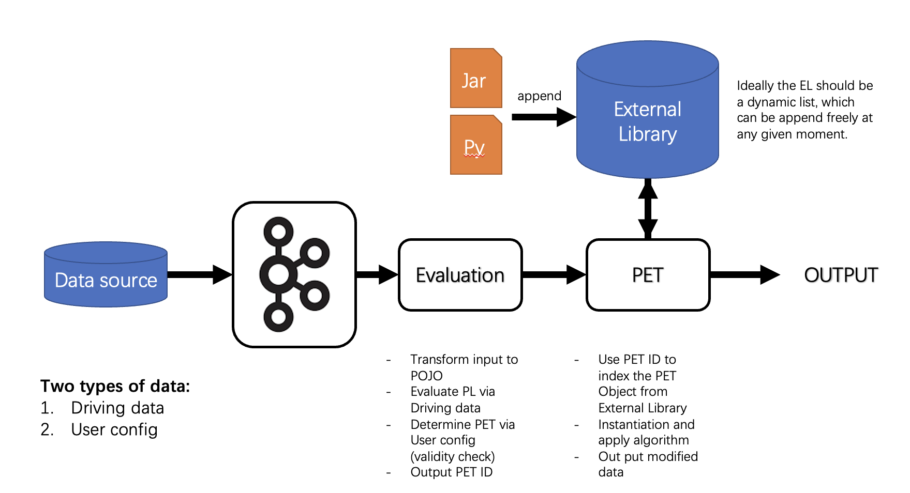
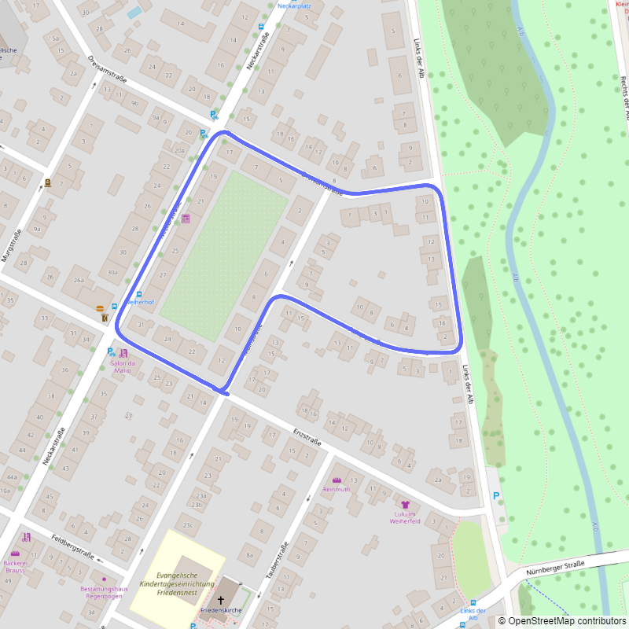
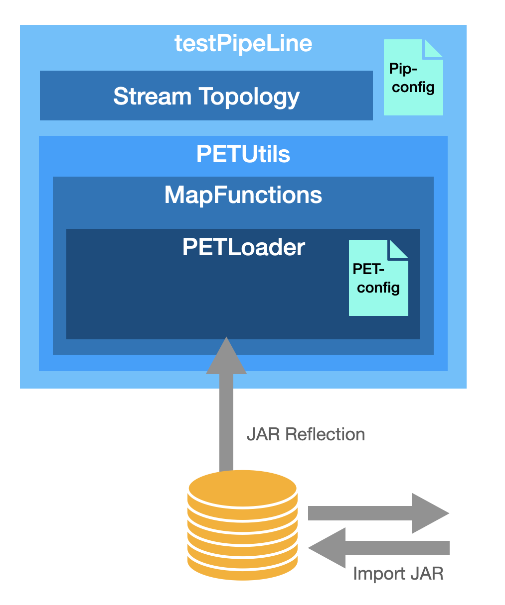

# pis_project_ss2023_group2
Practical Information System Project

## Introduction
The target is to avaluate and build a streaming process to handle the driving data for a car. It needs to be dynamically changeeable and adapt user input. In this project we'll use Flink and NiFi to implement the task and find out which one is better in sense of performance and implementation/ deplotment effort. The main focus of the project should be:
1. Whether the framework is capable to load new PET policy from external sources.
2. The performance when PET is de/activated, changed or even introduced in runnung environment.<br>

   

## Data
The data that we used in this project is part of the [KITTI dataset](https://www.cvlibs.net/datasets/kitti/). We took a single trace of the KITTI and applied a little reformulation to better fit out use case. The data we used contains the GPS, IMU and image information. For simplicity we only use one channel from the RGB camera data.<br>

## Dynamic JAR package loading
One of the main challenge in this task is the dynamic loading of JAR package. (Since we are constructing Flink pipeline using JAVA) It will be extremly convinient if we can directly add or remove JAR package from an external library where the Streaming process can load new Policy from. So we've constructed a new `PETLoader` to read the configuration file and reflect the object and class in JAR package to the StreamMapFunctions.<br>
<br>
The PET will read the configuration file `PETconfig.json` with the following format:
```json
  "LOCATION": {
    "0": {
      "FileName": "LocationPET01-1.0-SNAPSHOT.jar",
      "Description": "",
      "FunctionName":"pis.group2.LocationAnonymizer",
      "ConstructorParameter": ["java.lang.Integer",
        "java.lang.Integer",
        "java.lang.Double"],
      "Default": [3, 15, 10.0],
      "FunctionParameter": ["org.apache.flink.api.java.tuple.Tuple2"]
    }
```
To use the PETLoader class, you only need to create the object and call the `instantiate()` method, and then through the `invoke()` function you can easily get an Arraylist of returns.
```java
PETLoader<Tuple2<Double, Double>> pl_loc = new PETLoader<>("config/PETconfig.json", "LOCATION", 1);
        pl_loc.instantiate();
        ArrayList<Tuple2<Double, Double>> invoke = pl_loc.invoke(new Tuple2<>(48.985771846331,8.3941997039792));
        System.out.println(invoke);
```
## PET
The actual content of the PET is not the main focus of this project, hence we just apply the PET developed by Dominik in his [Bachelor thesis](https://www.google.com/url?sa=t&rct=j&q=&esrc=s&source=web&cd=&ved=2ahUKEwjS95jhyb3_AhW7gP0HHRspDtkQFnoECB4QAQ&url=https%3A%2F%2Felib.uni-stuttgart.de%2Fbitstream%2F11682%2F12182%2F1%2FBA%2520Dominik%2520Held.pdf&usg=AOvVaw3DbbWmswzYB4PQAMDqNi6e). As we need to use the PET Loader, we first seperate the different algorithmen into many sub JAR package which implments the  `PETProcesse` Interface. So that the JAR can be derictly load into the pipeline. The PETs might not be useful in the real life application after the modification, but it can show the dynamic properties in the evaluation process.

## DataGenerator
For the generating of the data introduced by KITTI dataset. We constructed a DataGenerator, a Java Programm which publish the user specified data to a Kafka Server. And the downstream piprline will subscribe to each topic. So that we utilize the upstream infastructure to make sure no bias in the evaluation and also simplify the implementation. We use totally three topics: `test-data`, `test-image` and `user` to accept String input of GPS data, Bytearray of camera perception and also the user configuration change. The Generator contains a Texture User Interface(TUI) to acept user input, the command suported by the program are listed as follow:
| Nr. | Command | Parameter | Description |
| --- | --------------- | ----------------------|----------------------------------------- |
| 1 | run    |--number X|Publish X message(including GPS and Camera data) to the topic|
| 2 | delayrun    |--number X --delay Y | Publish X message(including GPS and Camera data) to the topic, with a delay between each message Y seconds|
| 3 | write    |--msg X| Write message to user topic to specify new user configuration|
| 4 | reset    ||Reset the pointer for data to 0|
| 5 | exit    ||Exit the Generator programm|

## Evaluation