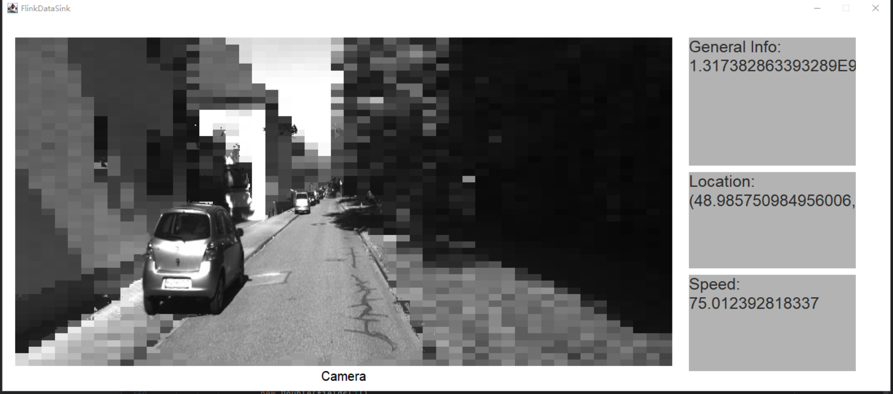
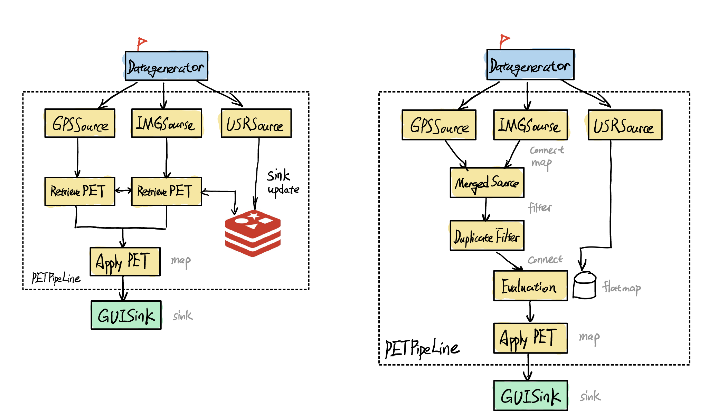

# pis_project_ss2023_group2
Practical Information System Project

## Introduction
The target is to avaluate and build a streaming process to handle the driving data for a car. It needs to be dynamically changeeable and adapt user input. In this project we'll use Flink and NiFi to implement the task and find out which one is better in sense of performance and implementation/ deplotment effort. The main focus of the project should be:
1. Whether the framework is capable to load new PET policy from external sources.
2. The performance when PET is de/activated, changed or even introduced in runnung environment.<br>

   

## Data
The data that we used in this project is part of the [KITTI dataset](https://www.cvlibs.net/datasets/kitti/). We took a single trace of the KITTI and applied a little reformulation to better fit out use case. The data we used contains the GPS, IMU and image information. For simplicity we only use one channel from the RGB camera data.<br>

## Dynamic JAR package loading
One of the main challenge in this task is the dynamic loading of JAR package. (Since we are constructing Flink pipeline using JAVA) It will be extremly convinient if we can directly add or remove JAR package from an external library where the Streaming process can load new Policy from. So we've constructed a new `PETLoader` to read the configuration file and reflect the object and class in JAR package to the StreamMapFunctions.<br>
<br>
The PET will read the configuration file `PETconfig.json` with the following format:
```json
  "LOCATION": {
    "0": {
      "FileName": "LocationPET01-1.0-SNAPSHOT.jar",
      "Description": "",
      "FunctionName":"pis.group2.LocationAnonymizer",
      "ConstructorParameter": ["java.lang.Integer",
        "java.lang.Integer",
        "java.lang.Double"],
      "Default": [3, 15, 10.0],
      "FunctionParameter": ["org.apache.flink.api.java.tuple.Tuple2"]
    }
```
To use the PETLoader class, you only need to create the object and call the `instantiate()` method, and then through the `invoke()` function you can easily get an Arraylist of returns.
```java
PETLoader<Tuple2<Double, Double>> pl_loc = new PETLoader<>("config/PETconfig.json", "LOCATION", 1);
        pl_loc.instantiate();
        ArrayList<Tuple2<Double, Double>> invoke = pl_loc.invoke(new Tuple2<>(48.985771846331,8.3941997039792));
        System.out.println(invoke);
```
## PET
The actual content of the PET is not the main focus of this project, hence we just apply the PET developed by Dominik in his [Bachelor thesis](https://www.google.com/url?sa=t&rct=j&q=&esrc=s&source=web&cd=&ved=2ahUKEwjS95jhyb3_AhW7gP0HHRspDtkQFnoECB4QAQ&url=https%3A%2F%2Felib.uni-stuttgart.de%2Fbitstream%2F11682%2F12182%2F1%2FBA%2520Dominik%2520Held.pdf&usg=AOvVaw3DbbWmswzYB4PQAMDqNi6e). As we need to use the PET Loader, we first seperate the different algorithmen into many sub JAR package which implments the  `PETProcesse` Interface. So that the JAR can be derictly load into the pipeline. The PETs might not be useful in the real life application after the modification, but it can show the dynamic properties in the evaluation process.

## DataGenerator
### Command Line Mode
For the generating of the data introduced by KITTI dataset. We constructed a DataGenerator, a Java Programm which publish the user specified data to a Kafka Server. And the downstream piprline will subscribe to each topic. So that we utilize the upstream infastructure to make sure no bias in the evaluation and also simplify the implementation. We use totally three topics: `test-data`, `test-image` and `user` to accept String input of GPS data, Bytearray of camera perception and also the user configuration change. The Generator contains a Texture User Interface(TUI) to acept user input, the command suported by the program are listed as follow:
| Nr. | Command | Parameter | Description |
| --- | --------------- | ----------------------|----------------------------------------- |
| 1 | run    |--number X|Publish X message(including GPS and Camera data) to the topic|
| 2 | delayrun    |--number X --delay Y | Publish X message(including GPS and Camera data) to the topic, with a delay between each message Y seconds|
| 3 | write    |--msg X| Write message to user topic to specify new user configuration|
| 4 | reset    ||Reset the pointer for data to 0|
| 5 | script  |-name X|Read the script in script folder with name X and execute the commands in ti|
| 5 | exit    ||Exit the Generator programm|

### GUI mode
The Data Generator can also be launched as the form of a Graphical User Interface, where user can directly interact with the buutton and editable text area.<br>


## Redis
For one variation of the pipeline we use the Redis nosql to work as the global statemanager since the petpolicy state should be maintained in a bird eye view. For simplicity we used the server by Amazon in the cloud, which can be access with the following command:
```
redis://<username>:<password>@redis-17361.c81.us-east-1-2.ec2.cloud.redislabs.com:17361
```
The current situation, policy and an extra dirty byte will be store in the cloud, wo that every process can access with a simple Jedis client(by the way also need to be serialized).

## Sink GUI
In the reality those Streamming process shouldn't connect to a GUI sink like that. Since the Database is not the focus in this project, we use this only for demostration.<br>
<br>

## Implementation of the Pipeline
There are totally two implementation of the pipeline, which shown in the koncept graph below.<br>
<br>

### Variation 1

Variation 1 is shown on the right side, in which the GPS Data and the Image data is merge as a single data POJO object at the beginning, and then passed to the evaluation block and the ApplePET block. The adventage of such kind of design is that, the state management and PET evaluation would be more convinient. As we don't need to consider the information exchange among the different workers.The structure is more "intuitive". But a huge down side is the complexity to merge two streams toghther, in which one should deal with the order and duplicate of messages±(means we need to find method to ensure exactly-one logic) that's why we need Duplicate filter and an extra MergeSensor(RichCoFlapMapFunction) block.

### Variation 2
In this variation we deal with the Image and GPS data seperately, so we don't have the logic problem caused by merge Stream. But the problem then would be the management of the global states. Which we applied the Redis database to compromiss this issue.

### Variation 3
In case there are also demands on dynamic Data Source operations, like if the PET can change the incoming data stream to fit the new requirements. We developed also the variation 3 to deal with such kind of situation. In Flink it's not possible to locally inteprupt the execution of the Topology. So we use a bypass: first we merge all the information sources into a single data package and pass them to the stream, the PET will select the Streams they are going to use ad forward them.<br>
The lead us to a modification of the design of Pipelines. It turns out that the most of the job for Pipeline implementation is fixed. So, it would be readonable to wrap them into a `PETProcessor` to further simplify the code implementation for our users. The structure is shown in the following figure:<br>
<br>

## NiFi Implementation
NiFi is more intuitive in sense of Topology, since it programm in a GUI. But the downside is that the invocation of packages and functions (from java perticularlly) is strictly restricted. As far as I know only in the form of command line, so it has restrict the usability of NiFi in this approach. But use still test the feasability of NiFi regarding to the dunamisc stream switching, turns out NiFi support the method well enough. The test Topology is also shown following:<br>
<br>

## Evaluation